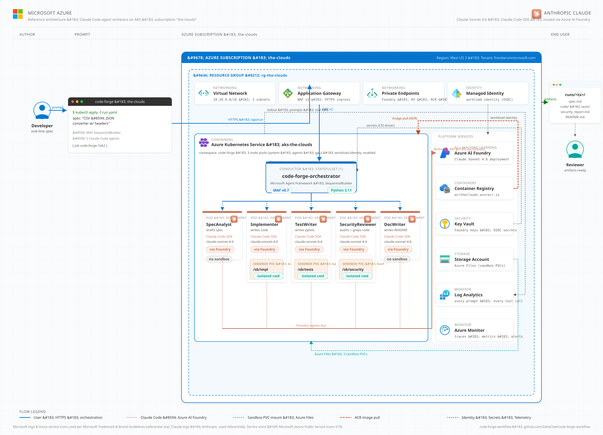

# Code Forge — Multi-Agent Coding Pipeline as a Graph Workflow

A working demo of the **[Microsoft Agent Framework](https://learn.microsoft.com/agent-framework/workflows/)** graph workflow API, where five specialised AI agents collaborate to turn a one-line feature request into a spec, an implementation, tests, a security review, and docs — with a real **security-gated revision loop**.

This is not a hello-world chain. It exercises the parts of Agent Framework that actually matter when you graduate from a single agent to a real pipeline:

- Agents wrapped as `AgentExecutor` nodes
- Custom `Executor` classes with typed `@handler` methods
- **Fan-out** to three reviewers in parallel
- **Fan-in** aggregation
- **Switch-case routing** on a verdict field
- A **conditional loop** back to a previous node
- Type-safe dataclass messages flowing edge-to-edge
- Shared workflow state via `ctx.set_state` / `ctx.get_state`

## The graph



> **Azure reference deployment** (`docs/architecture-azure-aks.svg`): the orchestrator and all five agent pods run on **AKS** in subscription **the-clouds**. The SecurityReviewer container talks to **Claude Sonnet 4.6 via Azure AI Foundry**; the rest hit Azure OpenAI. Every agent gets its own sandbox PVC backed by Azure Files, and Key Vault, Container Registry, and Log Analytics handle secrets, image pulls, and per-prompt audit trails. Open `docs/architecture-azure-aks.html` for a framed view.

### Logical workflow

```
       [user task: str]
              |
              v
        SpecAnalyst (agent)
              |
              v
        spec_to_request  (custom executor)
              |
              v
       Implementer (agent) <----------+
              |                       |
              v                       |
        fanout_for_review             | (loop on CHANGES_REQUESTED,
         |    |    |                  |  capped at MAX_REVISIONS)
         v    v    v                  |
       Test  Sec   Doc                |
       Wri.  Rev.  Wri.               |
         |    |    |                  |
         +----+----+                  |
              |                       |
              v                       |
        aggregator (fan-in)           |
              |                       |
              v                       |
        switch_case_edge_group        |
         /              \             |
   APPROVED        CHANGES_REQUESTED  |
         |              |             |
         v              +-------------+
       finalize  -->  FinalArtifact
```

Roles:

| Agent | Job |
| --- | --- |
| `SpecAnalyst` | Turn raw request into structured spec (REQUIREMENTS, INTERFACE, EDGE CASES) |
| `Implementer` | Produce a single-module Python implementation |
| `TestWriter` | Write pytest tests for the public interface |
| `SecurityReviewer` | Audit for injection, validation, DoS, etc. Emits `VERDICT: APPROVED` or `CHANGES_REQUESTED` |
| `DocWriter` | Write a tight README section |

## Quick start

```bash
git clone https://github.com/<your-fork>/code-forge-workflow
cd code-forge-workflow

uv venv .venv --python 3.11
source .venv/bin/activate
uv pip install --prerelease=allow -e .

cp .env.example .env
# edit .env — set OPENAI_API_KEY (or AZURE_OPENAI_* vars)

python examples/run.py
# or with a custom task:
python examples/run.py "build a thread-safe LRU cache"
```

### Mixed-provider mode (OpenAI + Claude Code)

This project demonstrates Microsoft Agent Framework's
[Claude Agent SDK integration](https://devblogs.microsoft.com/agent-framework/build-ai-agents-with-claude-agent-sdk-and-microsoft-agent-framework/).
Different graph nodes can be backed by **different LLM providers** without
changing the workflow topology — every agent implements the same `BaseAgent`
interface.

By default the **SecurityReviewer is routed to Claude** (via the local
`claude` CLI) while the rest run on OpenAI. Claude's audits are noticeably
sharper at catching real bugs in code review.

```bash
# Prereq: Claude Code CLI installed and signed-in (https://claude.com/claude-code)
which claude && claude --version

uv pip install --prerelease=allow agent-framework-claude

# Default — Claude reviews, OpenAI does the rest
python examples/run.py

# Or override:
CODE_FORGE_PROVIDERS=all-openai python examples/run.py
CODE_FORGE_PROVIDERS=all-claude  python examples/run.py
CODE_FORGE_PROVIDERS="security_reviewer=claude,implementer=claude" python examples/run.py
```

The runner prints which provider served each role at the top of every run,
and writes the resolved routing to `runs/<ts>/routing.txt` for the record.

### Run Claude through Microsoft Foundry

Instead of hitting Anthropic's public API, you can route every Claude
invocation through your **Foundry-deployed Claude models** (East US 2 /
Sweden Central) so inference, billing, and audit logs stay inside your
Azure tenant.

```bash
# 1. Deploy claude-sonnet-4-6 / haiku-4-5 / opus-4-6 in your Foundry project
# 2. Sign in with Entra ID
az login

# 3. Tell the Claude Code CLI to use Foundry
export CLAUDE_CODE_USE_FOUNDRY=1
export ANTHROPIC_FOUNDRY_RESOURCE=<your-foundry-resource-name>
export ANTHROPIC_DEFAULT_SONNET_MODEL=claude-sonnet-4-6
export ANTHROPIC_DEFAULT_HAIKU_MODEL=claude-haiku-4-5
export ANTHROPIC_DEFAULT_OPUS_MODEL=claude-opus-4-6
export CODE_FORGE_CLAUDE_MODEL=claude-sonnet-4-6   # match a deployment name

python examples/run.py
# ▶ Claude backend: Microsoft Foundry (<your-resource-name>)
```

The runner prints the active backend at the top of every run so you can
verify a Foundry-routed run at a glance.

### Per-agent sandboxes

Every Claude-backed agent gets its own isolated working directory under
`runs/<ts>/sandboxes/<role>/`. The Claude Code CLI's bash sandbox is
enabled (macOS `sandbox-exec` / Linux `bwrap`) so each agent's `Bash`,
`Write`, and `Edit` tools can only touch its own scratch dir — two
agents writing to `./scratch.txt` won't clobber each other, and a
runaway agent can't reach into your repo. `git` is in the
`excludedCommands` list so it can still run when needed.

```bash
# Original demo task (slugifier):
python examples/run.py "Build a thread-safe LRU cache class with TTL eviction"
```

Each run drops artifacts in `runs/<timestamp>/`:

```
runs/20260604-103728/
├── spec.md
├── implementation.py
├── tests.py
├── security_report.md
├── README.md          (the agent-written one)
├── routing.txt        (which provider served each role)
├── sandboxes/         (one isolated subdir per Claude agent)
│   └── securityreviewer/
└── trace.txt          (every WorkflowEvent emitted)
```

## What it actually does

When you launch a task, the workflow:

1. **SpecAnalyst** ingests the raw prompt and produces a structured spec.
2. The custom `spec_to_request` executor lifts the spec into shared state and rewrites it as an Implementer prompt.
3. **Implementer** writes a Python module.
4. `fanout_for_review` packages the spec + impl and emits **three messages in parallel** to TestWriter, SecurityReviewer, DocWriter (using `ctx.send_message(..., target_id=...)`).
5. Each branch's response is tagged and forwarded into a **fan-in edge** that lands in `aggregator`.
6. `aggregator` parses the security verdict.
7. `add_switch_case_edge_group` routes:
   - `APPROVED` → `finalize` (yields `FinalArtifact` as workflow output)
   - `CHANGES_REQUESTED` (and under revision cap) → `revision_loop` → back to **Implementer** with the security feedback baked into the prompt.
8. After `MAX_REVISIONS` the workflow falls through to `finalize` even on a still-failing verdict, so the loop is bounded.

## Project layout

```
src/code_forge/
  agents.py     # 5 role agents built from one OpenAIChatClient (or Azure)
  workflow.py   # WorkflowBuilder graph: edges, fan-out/in, switch-case, loop
examples/
  run.py        # async entry point that streams events and writes artifacts
```

## Why this shape?

Most "multi-agent" demos are linear: A → B → C. A graph workflow earns its keep when:

- You need to **parallelise** independent sub-tasks (review branches).
- You need a **deterministic gate** in the middle of an LLM pipeline (the security verdict isn't decided by an LLM picking the next tool — it's decided by a switch-case on a parsed field).
- You need a **loop with a hard cap**, not an open-ended ReAct cycle.

Workflows give you that with type-safe edges and an immutable graph you can serialise, visualise, and replay — instead of a tangle of LLM-driven control flow.

## License

MIT.
